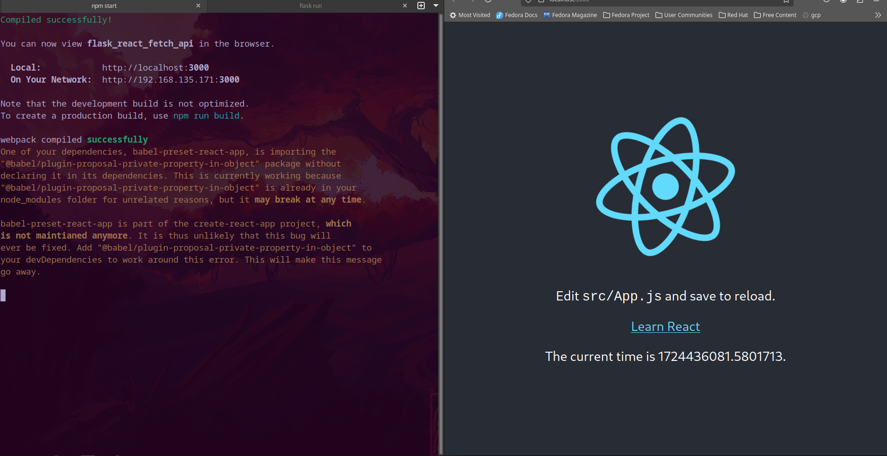

# React Flask Fetching API

to run this project :

    npm run
    cd api
    flask run 

Result :

Refferance

[flask react 1](https://blog.miguelgrinberg.com/post/how-to-create-a-react--flask-project)

[flask react 2](https://blog.miguelgrinberg.com/post/how-to-deploy-a-react--flask-project)